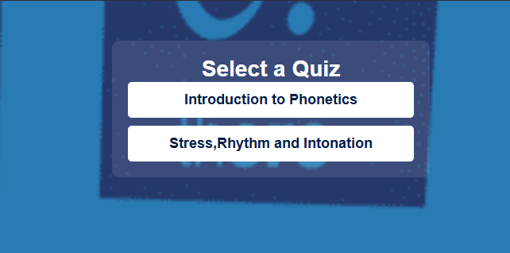
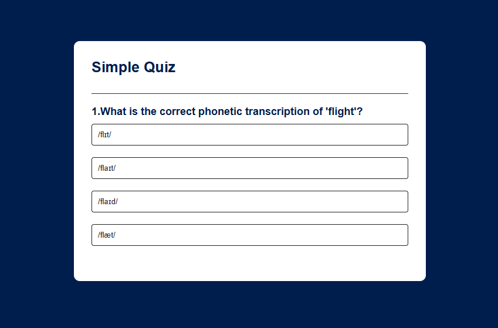

# Quiz App

A interactive quiz application that tests knowledge in various topics including Phonetics, Stress, Rhythm and Intonation.

## Features

- Multiple quiz categories to choose from
- 20+ questions per quiz
- Interactive interface with immediate feedback
- Score tracking
- Responsive design

## Technologies Used

- **HTML** - For app structure and content
- **CSS** - For styling and responsive design
- **JavaScript** - For interactive functionality
- **JSON** (`questions.json`) - For storing and managing quiz questions

## Quiz Categories

1. Introduction to Phonetics
2. Stress, Rhythm and Intonation

## How It Works

1. Select a quiz from the main menu
2. Answer 20+ questions in the selected category
3. Receive your score at the end
4. Option to retake or choose another quiz

## Screenshots

### Main Menu
  
*Selection screen with available quizzes*

### Quiz Interface
  
*Sample question during a quiz*

### Results Page
  
*Final score display after completing a quiz*
